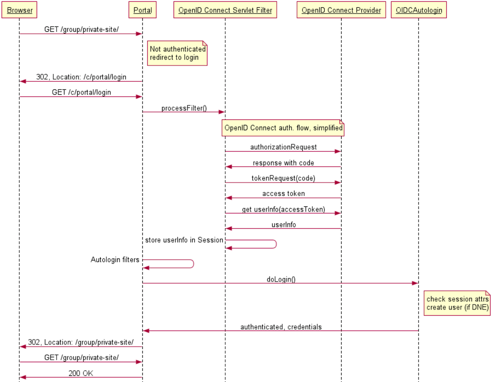

# OpenID Connect Liferay plugin
This plugin uses the OpenID Connect protocol to make Liferay use external authentication sources like social networks and SSO systems.
It is [available in the Liferay Marketplace](https://web.liferay.com/marketplace/-/mp/application/78695724).

## Introduction

The OpenID Connect protocol delegates authentication to a so called Provider, and supplies the requesting application (in our case: Liferay) with an access token (like a temporary, restricted password) to request additional user information.
 With this user information, a Liferay-account is created if it does not exist, and to Liferay the user authentication is confirmed. 

### Components

The plugin comprises of two parts:

* a Servlet Filter (using Liferay's servlet filter hook) to intercept the normal login flow and redirect to the OpenID Connect provider, get the access token and get user information 
* an Autologin (using Liferay's portal properties hook `auto.login.hooks=`) to complete the authentication

### Configuration
The following portal properties are required (in portal-ext.properties) for a complete setup:

#### `openidconnect.enableOpenIDConnect`
Whether to enable the plugin (effectively allowing you to disable the plugin without uninstalling it). Boolean, either 'true' or 'false'. Default is false.

#### `openidconnect.authorization-location`
Complete url to the OpenID Connect Provider's authorization location. Example for Google: `https://accounts.google.com/o/oauth2/v2/auth`

#### `openidconnect.token-location`
Complete url to the OpenID Connect Provider's token location. Example for Google: `https://www.googleapis.com/oauth2/v4/token`

#### `openidconnect.profile-uri`
Complete URL to the 'user info' endpoint. Example for Google: `https://www.googleapis.com/plus/v1/people/me/openIdConnect`

#### `openidconnect.issuer`
The information retrieved from the user info endpoint has to be verified against a preconfigured string, according to the OpenID Connect spec.
This 'issuer' claim is used for that. Example for Google: `https://accounts.google.com`

#### `openidconnect.client-id`
Register your Liferay portal as a 'client app' with the Google developer console, and the resulting client id is the openid connect client id.
Non-working example for Google: `7kasuf1-123123adfaafdsflni7me2kr.apps.googleusercontent.com`

#### `openidconnect.secret`
Secret of the client, after registration of the Liferay portal, just like the client-id.

### `openidconnect.scope`
Scope(s) of the access token (space separated), should be the same (or a subset) of the scopes allowed by the provider to the client. Default value: `openid profile email`

### Complete copy-paste-friendly code block with all properties

~~~
openidconnect.enableOpenIDConnect=true
openidconnect.token-location=https://www.googleapis.com/oauth2/v4/token
openidconnect.authorization-location=https://accounts.google.com/o/oauth2/v2/auth
openidconnect.profile-uri=https://www.googleapis.com/plus/v1/people/me/openIdConnect
openidconnect.issuer=https://accounts.google.com
openidconnect.client-id=7kasuf1-123123adfaafdsflni7me2kr.apps.googleusercontent.com
openidconnect.secret=xyz
openidconnect.scope=openid profile email
~~~

### Try out with Google as OIDC Provider

* Create a project at https://console.developers.google.com/apis/dashboard, of type 'web application'
* Create credentials, of type 'OAuth Client ID'
    * Application type: 'web application'
    * Name: anything, like 'My Liferay portal'
    * Authorised redirect URIs: `http://localhost:8080/c/portal/login` (or any public URL, but it has to end in the Liferay's special path `/c/portal/login`)
    * Copy-paste the created client credentials into your portal-ext.properties
* Configure the plugin with the rest of the properties, as stated above.

### Sequence diagram
This diagram focuses on the interaction of typical Liferay components and components of the plugin. 
It simplifies the actual OpenID Connect authorization code flow a bit, which is documented properly in other locations.

Sequence diagram rendered by https://www.websequencediagrams.com/, with source code:
~~~
title Liferay OpenID Connect authentication

Browser->Portal: GET /group/private-site/
note right of Portal
    Not authenticated
    redirect to login
end note
Portal->Browser: 302, Location: /c/portal/login
Browser->Portal: GET /c/portal/login
Portal->OpenID Connect Servlet Filter: processFilter()
note over OpenID Connect Servlet Filter, OpenID Connect Provider: OpenID Connect auth. flow, simplified
OpenID Connect Servlet Filter->OpenID Connect Provider: authorizationRequest
OpenID Connect Provider->OpenID Connect Servlet Filter: response with code
OpenID Connect Servlet Filter->OpenID Connect Provider: tokenRequest(code)
OpenID Connect Provider->OpenID Connect Servlet Filter: access token
OpenID Connect Servlet Filter->OpenID Connect Provider: get userInfo(accessToken)
OpenID Connect Provider->OpenID Connect Servlet Filter: userInfo
OpenID Connect Servlet Filter->OpenID Connect Servlet Filter: store userInfo in Session
Portal->Portal: Autologin filters
Portal->OIDCAutologin: doLogin()
note right of OIDCAutologin
    check session attrs
    create user (if DNE)
end note
OIDCAutologin->Portal: authenticated, credentials
Portal->Browser: 302, Location: /group/private-site/
Browser->Portal: GET /group/private-site/
Portal->Browser: 200 OK
~~~

### License
This software is licensed under the Apache 2 license.

